# Rechtliche Begutachtung

	P_N = 100 kW
	h = 50 m
	n = 20

1. Welche grundsätzlichen Varianten der Netzanschlusszertifizierung (EZE und EZA) für die o.g. EZA in 2021 müssen betrachtet werden und welche Zertifikate davon müssen noch erstellt werden, welche sind bereits vorhanden?
2. Welche Maßnahmen müssen geplant und umgesetzt werden, um alle 20 EZE in 2021 aufzustellen?

## Allgemein

Requirements depend on the voltage connection level and the active power capacity of the unit:

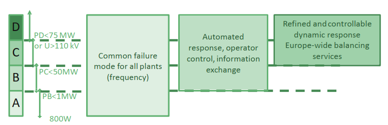

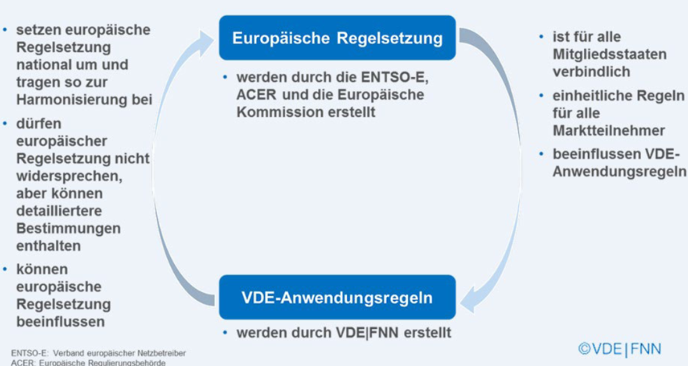

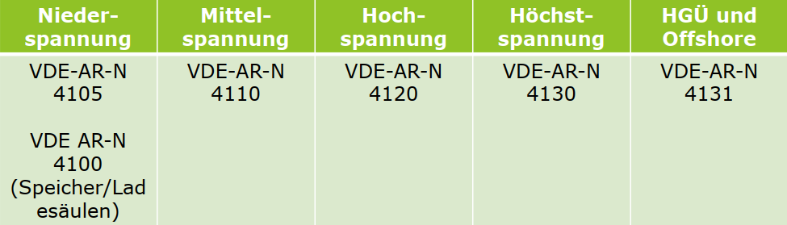

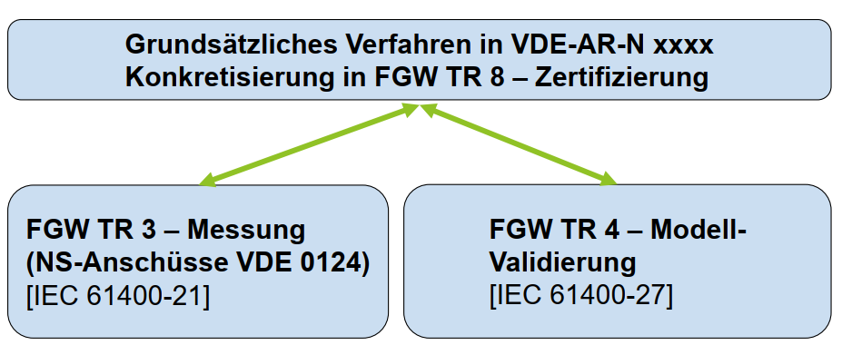

## NELEV

> § 2 Abs. 1 NELEV
>> Betreiber von Erzeugungsanlagen haben dem zuständigen Netzbetreiber im Rahmen des Betriebserlaubnisverfahrens nach Artikel 29 der Verordnung (EU) 2016/631 nachzuweisen, dass die allgemeinen technischen Mindestanforderungen nach § 19 des Energiewirtschaftsgesetzes eingehalten werden.

> § 19 Abs. 4 EnWG
>> Betreiber von Energieversorgungsnetzen haben die allgemeinen technischen Mindestanforderungen nach Absatz 1 und Absatz 3 unter Berücksichtigung der Vorgaben der Verordnung (EU) 2016/631 der Kommission vom 14. April 2016 zur Festlegung eines Netzkodex mit Netzanschlussbestimmungen für Stromerzeuger (ABl. L 112 vom 27.4.2016, S. 1) zu erstellen.

> § 3 Abs. 1 NELEV
>> Bei dem Nachweis nach § 2 sind vorbehaltlich sonstiger Rechtsvorschriften die allgemein anerkannten Regeln der Technik zu beachten.

> § 4 NELEV
>> Netzbetreiber müssen eine endgültige Betriebserlaubnis verweigern, wenn die Nachweispflicht nicht eingehalten wurde.

> Netzbetreiber erteilt mit ausgefüllten Formblatt E.7 der VDE-AR-N 4110 eine vorübergehende Betriebserlaubnis

> Bei einheitlichen Wind-EZA: Erstellung der IE durch den Hersteller absolut sinnvoll.
>> Anders evtl. bei **gemischten** EZA

> Soweit der Netzbetreiber ein EZA-Modell fordert, ist dieses spätestens mit der KE zu übergeben (Anforderungen in Kapitel 10.6 der VDE-AR-N 4110 beschrieben). Plausibilisierungstests sind durchzuführen – ab Hochspannungsanschlüssen durch akk. ZE-Stellen gemäß NELEV

## Zertifizierungsverfahren gemäß VDE-AR-N 41xx

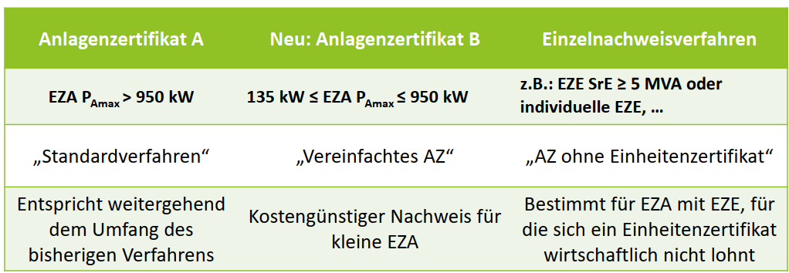

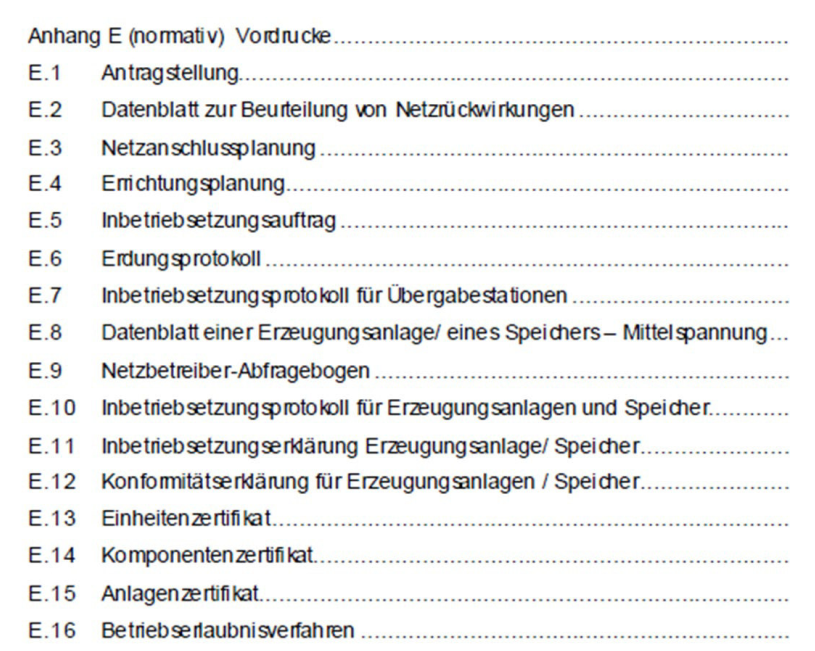

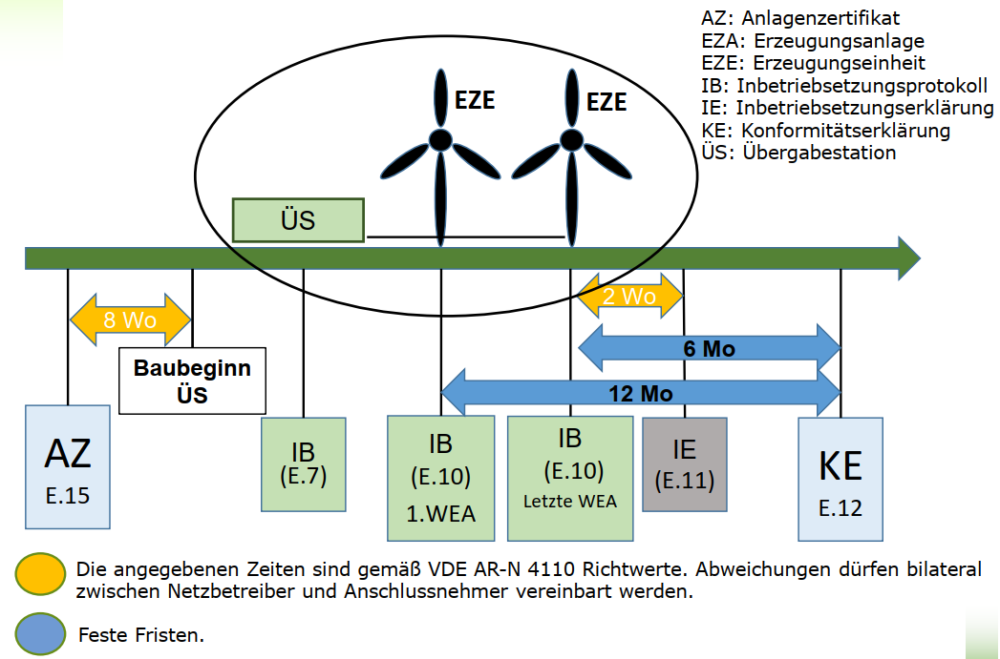

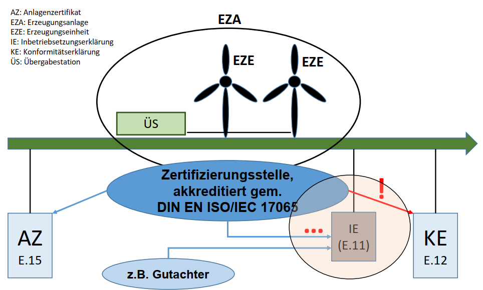

> Typ 1 EZE sind gemäß 4105 in der Regel jeweils eine EZA, auch wenn mehrere Typ 1 EZE über einem NAP einspeisen

### Zeitplan VDE-AR-N 4110

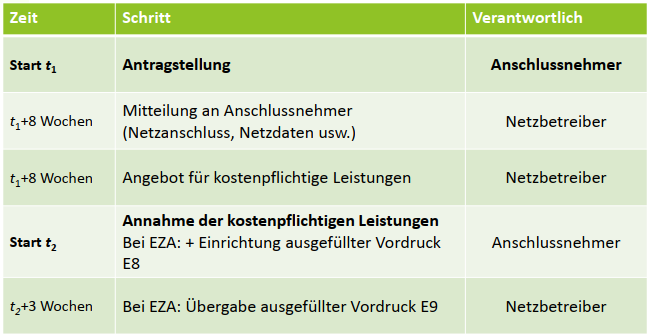

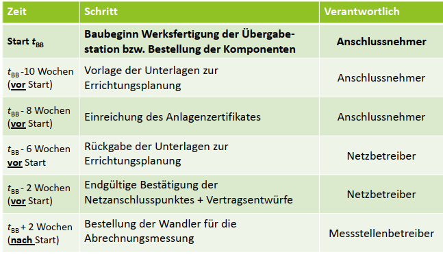

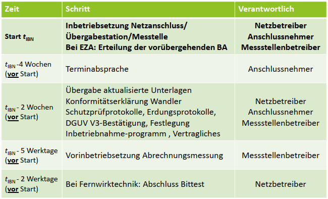

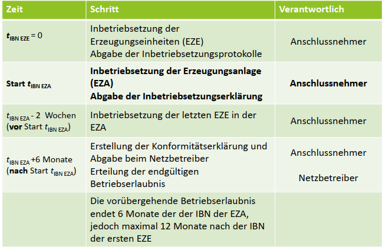

> Die angegebenen Zeiten sind Richtwerte. Abweichungen zu dem Zeitplan dürfen bilateral zwischen Netzbetreiber und Anschlussnehmer vereinbart werden. Insbesondere die Art, den Umfang und den Zeitpunkt zur Übergabe und zum Abschluss der notwendigen Netzverträge dürfen Netzbetreiber separat festlegen. Erforderliche Nachbesserungen dürfen die Zeitangaben verschieben.

> Beispiel: Das Anlagenzertifikat wird praktisch erst 4 Wochen vor IBN des Netzanschlusses möglich sein.

> Quasistationäre Betrieb ist definiert durch einen Spannungsgradienten von < 5 % Un/min und einen Frequenzgradienten von < 0,5 % fn/min. Der Nachweis für die EZE kann durch Herstellererklärungen erbracht werden

## Neuausstattung mit deutschen Wechselrichter

## Anschluss kundeneigenes MS-Netz

	n = 14

> Anlagenzertifikate (sowie Einheitenzertifikate) werden für alle EZA und Speicher mit Anschluss am Mittelspannungs- /Hochspannungsnetz gefordert.

> Komponentenzertifikate mindestens für
>> EZA-Regler

>> aktive statische Kompensationseinrichtungen (FACTs, SVCs, Statcom – keine Zertifizierung bei ungeregelten Drosseln, usw.)

>> Spannungsregler der Erzeugungseinheiten Typ 1

>> EZE-Schutzeinrichtungen, die nicht im Zuge der Einheitenzertifizierung vermessen wurden (gilt nicht für den Schutz am NAP)

> Konformitätserklärungen gemäß VDE AR-N 4110 nur noch von akkreditierten Zertifizierungsstellen auszustellen.

### Anschluss in bestehenden Mischparks >= 1 MW auf MS-Ebene (VDE-AR-N 4110)

	n = 10

#### Artikel 5 (3) Verordnung (EU) 2016/631

> „Vorschläge für die Schwellenwerte für die Maximalkapazität von Stromerzeugungsanlagen des Typs B, C und D bedürfen der Genehmigung der relevanten Regulierungsbehörde oder ggf. des Mitgliedstaats. Bei der Erarbeitung ihrer Vorschläge stimmen sich die relevanten ÜNB mit den benachbarten ÜNB und VNB ab und führen eine öffentliche Konsultation gemäß Artikel 10 durch.“

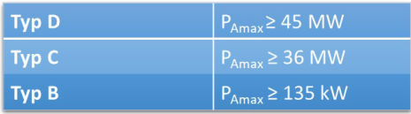

*Anlage nach Typ B?*

> Nachweisdokument und Betriebserlaubnis (BE)
>> Für die Betriebserlaubnis ab Typ B – EZA legt der Eigentümer dem relevanten Netzbetreiber ein Nachweisdokument vor

#### VDE AR-N 4110

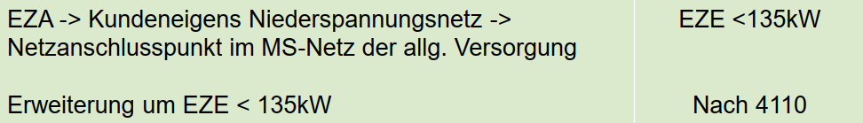

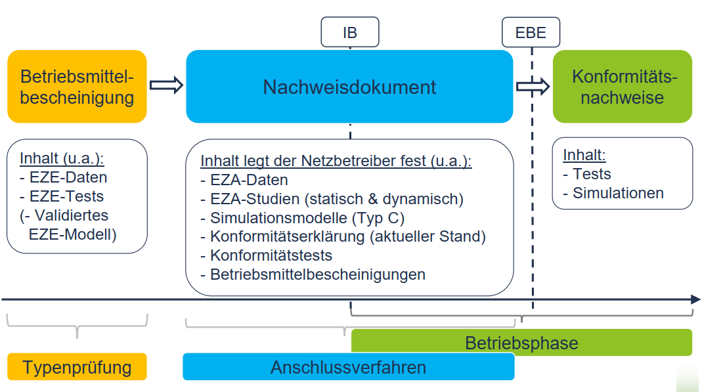

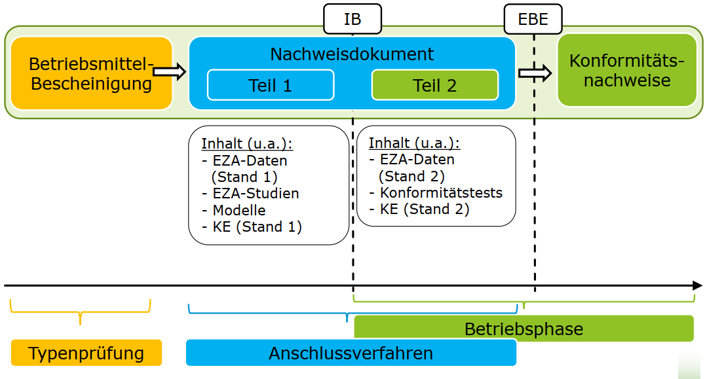

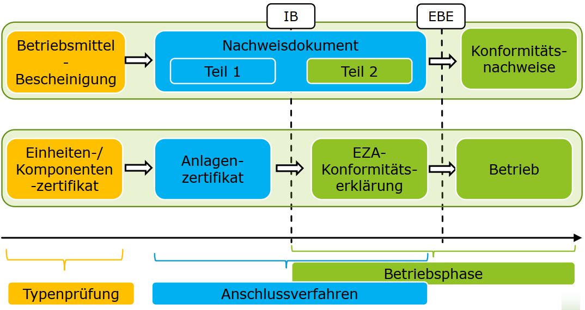

**Schritte des Zertifizierungsverfahrens**

1. Antrag auf Zertifizierung
2. Bewertung des Antrags
3. Erstellung eines Bewertungsberichtes (BWB)
4. Zertifizierungsentscheidung
5. Versendung des BWB und Zertifikats
6. Veröffentlichung
7. Überwachung

> Für die Planung eines Umbaus bzw. einer Erweiterung einer Kundenanlage ist auf den umzubauenden bzw. zu erweiternden Teil zum Zeitpunkt der Antragstellung für den Umbau bzw. die Erweiterung gültige technischen Anschlussregel anzuwenden.
>> Für die nicht von der Änderung betroffenen Anlagenteile gelten weiterhin die ursprünglichen Technischen Anschlussregeln.

#### NELEV

> Typ B und C – Anlagen mit MS-Anschluss
>> VDE AR-N 4110
>> Einheiten-Zertifizierungspflicht ergibt sich aus dem RfG
>> Projekt-Zertifizierungspflicht ergibt sich aus NELEV

### Sonstige auf MS-Ebene (VDE-AR-N 4110)

	n = 4

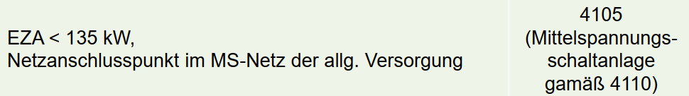

#### VDE AR-N 4110

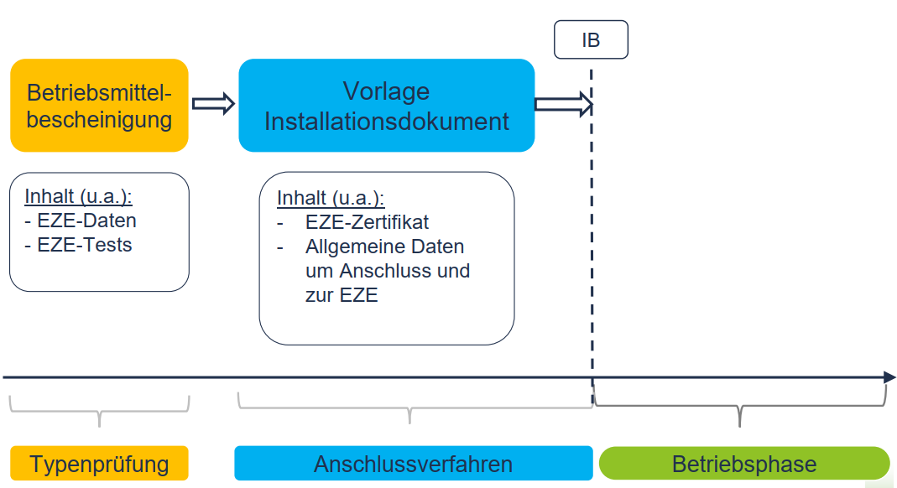

> EZA PAmax < 135 kW: Verfahren gemäß VDE-AR-N 4105

*Oder doch VDE-AR-N 4105?* **Anscheinend ja**

## Anschluss in Inselnetzen

	n = 6

*NS-Ebene?*

> Typ A und B – Anlagen mit NS-Anschluss
>> VDE AR-N 4105
>> Einheiten-Zertifizierungspflicht ergibt sich aus dem RfG

